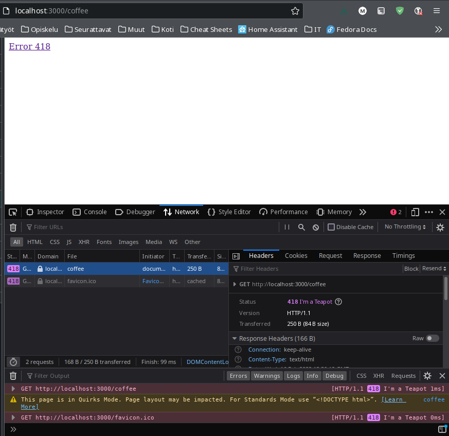
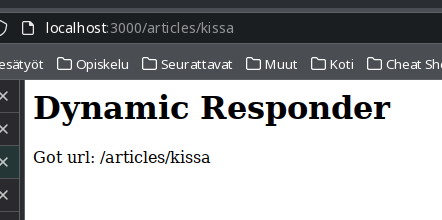

Help to complete the tasks of this exercise can be found from the chapters 4 ”Building a Simple Web Server in Node.js”, 5 “Handling Incoming Data”, and 6 “Writing Better Routes and Serving External Files” of our course book “Get Programming with Node.js” by Jonathan Wexler and from the chapter 4 “HTTP Servers and Clients” of the supplementary course book “Node.js Web Development” by David Herron. The aims of this exercise are 1) to learn to create Node.js web servers, 2) to route and handle http requests, and 3) to understand static assets.

Embed your theory answers, drawings, codes, and screenshots directly into this document. Always immediately after the relevant question. Return the document in itsLearning by the deadline.
It’s also recommendable to use Internet sources to supplement the information provided by the course book.

The maximum number of points you can earn from this exercise is 10 + 1 = 11. 

*Tasks:*
# 1. Request routing. (2 * 0,5 = 1 point)

## a. What is routing in Node.js is and what it does?

Routing is basically a way to determine how to respond to client's request. Response can be determined by the requests url, method and/or header information, which are provided to us by node.js.

Determining routing directly based on the request is the basic method, and has it's uses in case you can't use frameworks. The other option is to utilize a framework like express, which allow you to subdivide and organize the application into multiple smaller modules for easier development and maintenance.

## b. What kinds of request information can be used in routing? (1 point)

- Url
- Method
  - Like GET, POST etc.
- Header information
  - Like user-agent etc.


# 2. Installing and using nodemon. (4 * 0,5 = 2 points)

## a. Install nodemon locally as development dependency. (0.5 points)

```bash
npm install --save-dev nodemon
```

## b. What is the difference between installing nodemon locally or globally? List also some good and bad sides of both alternatives. (0.5 points)

Global installation is done directly to system's path (well, at least somewhere accessible via system's path). This makes nodemon available directly from the command line, usually for all users. That also means there is only one version of nodemon, and all the apps in the computer must "deal with it".

Installing locally, in the other hand, means installing nodemon as a single project's dependency in the project folder. That means nodemon is not available to all users (from the command line), but allows binding nodemon's version as needed by each project.

## c. Use nodemon. Document how do you do it. (0,5 points)

### Add a script for starting nodemon

I added a start script to package.json:

```json
"nodemon": "nodemon index.js"
```

### Start nodemon

And started the app with `npm run nodemon`. This works because `NODE_ENV` variable is set to `development` by default.

### Exit nodemon

Exit nodemon with `^C` *(Control-C)*.

## d. What are the main benefits of using nodemon (when developing web apps)? (0.5 points)

It restarts the node application whenever any source file on the file system changes, so you don't have to do it manually. So it speeds up the process and let's you focus.

# 3. Creating a simple web server. (2 points)

*Use CommonJS modules.*

Package json for this task:
```json
{
  "name": "t3",
  "version": "1.0.0",
  "description": "SSWD E03 T3",
  "main": "index.js",
  "scripts": {
    "nodemon": "nodemon index.js",
    "test": "echo \"Error: no test specified\" && exit 1"
  },
  "author": "Markus Ijäs",
  "license": "ISC",
  "devDependencies": {
    "nodemon": "^2.0.15"
  },
  "dependencies": {
    "http-status-codes": "^2.2.0"
  }
}
```

## a. Create a web server that logs information about the method, the url and the headers of the incoming request on a console. (1 point)

```js
const port = 3000;
const http = require("http");
const httpstatus = require("http-status-codes");
const app = http.createServer((request, response) => {
  console.log("Received an incoming request.");
  console.log(`Method info: ${request.method}`);
  console.log(`URL info: ${request.url}`);
  console.log(`Header info: ${JSON.stringify(request.headers)}`);
});

app.listen(port);

console.log(`The server has started and listens on port ${port}`);
```

## b. Use JavaScript template strings. (0,5 points)

Used, as seen above.

## c. Test the server by using a browser. (0,5 points)

*You can search help from the code listings in chapter 5 of the course book.* 


# 4. Serving simple web pages. (1 point)

*Use JavaScript ES6 modules.*

Package json:
```json
{
  "name": "t4",
  "version": "1.0.0",
  "description": "SSWD E03 T4",
  "main": "index.js",
  "type": "module",
  "scripts": {
    "nodemon": "nodemon index.js",
    "test": "echo \"Error: no test specified\" && exit 1"
  },
  "author": "Markus Ijäs",
  "license": "ISC",
  "devDependencies": {
    "nodemon": "^2.0.15"
  },
  "dependencies": {
    "http-status-codes": "^2.2.0"
  }
}
```

## a. Create a server that serves (static) webpages from a folder called views. Use routes. (0,5 points)

Here we go *(index.js)*:
```js
import * as http from "http";
import { StatusCodes } from "http-status-codes";
import * as fs from "fs";

const port = 3000;
const routeMap = {
  "/": "views/index.html",
  "/page": "views/page.html",
  "/coffee": "views/coffee",
};

const app = http.createServer((request, response) => {
  console.log(`Request URL: ${request.url}`);
  if (routeMap[request.url]) {
    fs.readFile(routeMap[request.url], (error, data) => {
      if (error) {
        // Of course we should actually reply with error 404 or 501 perhaps!
        response.writeHead(StatusCodes.IM_A_TEAPOT, {
          "Content-Type": "text/html",
        });
        response.write(
          '<a href="https://developer.mozilla.org/en-US/docs/Web/HTTP/Status/418">Error 418</a>'
        );
      } else {
        response.writeHead(StatusCodes.OK, {
          "Content-Type": "text/html",
        });
        response.write(data);
      }
      response.end();
    });
  } else {
    response.writeHead(StatusCodes.NOT_FOUND);
    response.write("<h1>File not found</h1>");
    response.end();
  }
});

app.listen(port);

console.log(`The server has started and listens on port ${port}`);
```

## b. Test the application by requesting different resources with a browser. (0,5 points)



# 5. Serving static assets. (2 points)

## a. What is meant by static assets? (0,5 points)

Basically anything sent to the user that's not source code, and that is not changed by the server. Images, CSS, PDFs etc.

## b. Create a web server that serves different kinds of static assets from subfolders of the folder called public. Use routes. (1 point)

*Package json is the same as in task 4.*

### index.js
```js
import * as http from "http";
import { StatusCodes } from "http-status-codes";
import * as fs from "fs";
import { extname } from "path";

const port = 3000;
const allowedContentTypes = {
  ".html": "text/html",
  ".js": "text/javascript",
  ".css": "text/css",
};

const respondWithError = (code, message, response) => {
  response.writeHead(code, {
    "Content-Type": "text/html",
  });
  response.write(`<h1>${message}</h1>`);
  response.end();
};

const getContentType = (filePath) => {
  let extension = extname(filePath);
  if (allowedContentTypes[extension]) {
    return allowedContentTypes[extension];
  }
  return "text/plain";
};

const respondWithFile = (filePath, response) => {
  if (!fs.existsSync(filePath)) {
    respondWithError(StatusCodes.NOT_FOUND, "File not found", response);
    return;
  }

  fs.readFile(filePath, (error, data) => {
    if (error) {
      console.log(error);
      respondWithError(
        StatusCodes.INTERNAL_SERVER_ERROR,
        "Error reading file",
        response
      );
      return;
    }

    response.writeHead(StatusCodes.OK, {
      "Content-Type": getContentType(filePath),
    });
    response.write(data);
    response.end();
  });
};

const app = http.createServer((request, response) => {
  console.log(`Request URL: ${request.url}`);
  respondWithFile(`./public${request.url}`, response);
});

app.listen(port);

console.log(`The server has started and listens on port ${port}`);
```

### File tree
```sh
$  tree public/
public/
├── css
│   └── styles.css
├── index.html
└── js
    └── scripts.js

2 directories, 3 files
```

## c. Give reasons to concentrate the static assets under the folder public. (0,5 points)

Concentrating static assets under a single folder allows us to:
- Cache them easily (be it the server, the client or something in between that actually does the caching).
- Manage them easily, since we don't have to search for them for example when some icon or css needs to change.
- Strip the assets away from our dynamic node application and serve them from another server (from AWS S3 bucket perhaps).

# 6. Handling requests for files that do not exist. (1 point)

## a. Add an error handling function to the previous examples. (0,5 points)

This is basically done on tasks 4 and 5 already, so no point in copying the same code here.

## b. Explain why the function is needed. (0,5 points)

To basically let the user know that something went wrong. We should also use proper error codes and proper messages in the error response.

# 7. Modularization. (2 points) 

## a. Move the routes of the web server you created in the previous task into a separate module. (1 point)

*Public folder is the same as in 5b with added index.html file for testing FileResponder.*

### index.js

Building index.js this way allows us to inject handlers to the router runtime, and decouples handler logic from routing.

```js
import * as http from "http";
import Router from "./router.js";
import FileResponder from "./file-responder.js";
import DynamicResponder from "./dynamic-responder.js";

const router = new Router();
const fileResponder = new FileResponder();
const dynamicResponder = new DynamicResponder();

const port = 3000;
const routingConfig = {
  GET: {
    "/": dynamicResponder,
    "/articles": dynamicResponder,
    "/articles/*": dynamicResponder,
    "/*": fileResponder,
  },
};

router.setRouteHandlers(routingConfig);

const app = http.createServer((request, response) => {
  console.log(`Request URL: ${request.url}`);
  router.handle(request, response);
});

app.listen(port);

console.log(`The server has started and listens on port ${port}`);
```

### router.js

Generic router with callbacks to injected handlers.

```js
import { StatusCodes } from "http-status-codes";

export default class Router {
  routeHandlers = {};

  /**
   * Set route handling rules.
   *
   * Rule may have generic regexp. * represents wild card (will be changed
   * to `[\w\./]*` eventually).
   *
   * Expects newRouteHandlers in format
   * {
   *   method: {
   *     rule: handler,
   *   }
   * }
   * @param {dictionary of dictionaries} newRouteHandlers
   */
  setRouteHandlers(newRouteHandlers) {
    this.routeHandlers = newRouteHandlers;
  }

  /**
   * Get proper handler for provided url
   *
   * @param {object} methodHandlers
   * @param {string} url
   * @returns handler object or null if not found
   */
  getProperHandler(methodHandlers, url) {
    for (const [key, handler] of Object.entries(methodHandlers)) {
      //console.log(key);
      let preparedRE = key.replace("*", "[\\w\\./]*");
      let re = new RegExp(`^${preparedRE}$`, "i");
      //console.log(re);
      //console.log(re.test(url));
      if (re.test(url)) {
        return handler;
      }
    }
    return null;
  }

  /**
   * Routes requests to specific handlers based on routeHandlers dictionary.
   *
   * Expects routeHandlers to be in format:
   * {
   *   "get": {
   *     "/": handler_callback,
   *   },
   *   "post": {
   *     "/target": post_handler,
   *   }
   * }
   * @param {object} request
   * @param {object} response
   */
  handle(request, response) {
    if (!this.routeHandlers[request.method]) {
      response.writeHead(StatusCodes.INTERNAL_SERVER_ERROR);
      response.end("Method handlers not found");
      return;
    }

    let handler = this.getProperHandler(
      this.routeHandlers[request.method],
      request.url
    );

    if (handler !== null) {
      handler.handle(request, response);
    } else {
      response.writeHead(StatusCodes.INTERNAL_SERVER_ERROR);
      response.end("Route handlers not found");
    }
  }
}
```

### file-responder.js

A handler for serving files from ./public subfolder.

```js
import * as fs from "fs";
import { extname } from "path";
import { StatusCodes } from "http-status-codes";

export default class FileResponder {
  contentTypesDefs = {
    ".html": { "Content-Type": "text/html" },
    ".js": { "Content-Type": "text/javascript" },
    ".css": { "Content-Type": "text/css" },
  };

  /**
   * Get content type object for file path / url.
   *
   * @param {string} filePath
   * @returns content type object, defaults to text/plain
   */
  getContentType(filePath) {
    let extension = extname(filePath);
    if (this.contentTypesDefs[extension]) {
      return this.contentTypesDefs[extension];
    }
    return { "Content-Type": "text/plain" };
  }

  /**
   * Responds with file from file system under ./public subfolder.
   * Responds 404 if file not found, 500 if file could not be read.
   *
   * @param {object} request
   * @param {object} response
   * @returns null on error
   */
  handle(request, response) {
    let filePath = `./public${request.url}`;

    if (!fs.existsSync(filePath)) {
      response.writeHead(StatusCodes.INTERNAL_SERVER_ERROR);
      response.end("File not found");
      return;
    }

    fs.readFile(filePath, (error, data) => {
      if (error) {
        console.log(error);
        response.writeHead(StatusCodes.INTERNAL_SERVER_ERROR);
        response.end("Error reading file");
        return;
      }

      response.writeHead(StatusCodes.OK, this.getContentType(filePath));
      response.end(data);
    });
  }
}
```

### dynamic-responder.js

Demonstration of dynamic request handler. This could be anything, a REST API handler for example.

```js
import { StatusCodes } from "http-status-codes";

export default class DynamicResponder {
  /**
   * Responds with hard-coded page info for demonstration purposes
   *
   * @param {object} request
   * @param {object} response
   * @returns null on error
   */
  handle(request, response) {
    response.writeHead(StatusCodes.OK, { "Content-Type": "text/html" });
    response.end(`<h1>Dynamic Responder</h1><p>Got url: ${request.url}</p>`);
  }
}
```

### Example run in screenshot below



## b. Make certain that you are serving at least one web page that is not in the listings. (1 point)

Didn't know what this meant. I still assume the 7a task completes this :D

