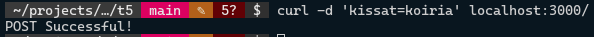

# SSWD E04

Help to complete the tasks of this exercise can be found on the chapters from ch. 8 ” Setting Up an App with Express” and ch. 9 “Routing in Express.js” of our course book “Get Programming with Node.js” by Jonathan Wexler, and from the supplementary course book “Node.js Web Development” by David Herron check ch.5 “Your First Express Application”. The aims of the exercise are get started with Express.js web application framework, to learn reading parameters and data from user’s requests and to understand MVC architecture.

Embed your theory answers, drawings, codes and screenshots directly into this document. Always immediately after the relevant question. Return the document in Teams by the deadline.
It’s also recommendable to use Internet sources to supplement the information provided by the course book.

The maximum number of points you can earn from this exercise is 10 + 1. 

*Tasks:*

# 1. Web Frameworks. (4 * 0,5 = 2 points)

## a. What is a web framework? 

A web framework is designed to support the development of web applications by providing a standard way to implement certain common things like templating, session management or database access.

## b. What kinds of functionality a web framework usually contains? 

For example:
- Templating engine
- Database access
- Session management
- Routing
- File management
- Caching
- Security (CSRF, input sanitation etc)
- Tools for building APIs
- Extending built-in functionality (with middleware, overriding libraries or by building new libraries/parts)

## c. Create a small note for yourself: The most useful contents available at https://expressjs.com/.

- [Guide](http://expressjs.com/en/guide/routing.html)
- [API Reference](http://expressjs.com/en/4x/api.html)

Also consider reading *Advanced topics* and *Resources*.

## d. Name at least 3 other popular web frameworks. 

- Django
- Laravel
- CodeIgniter
- Ruby on Rails

*You need have at least one more information source in addition to the course book. Provide the url to the source you used.*

Source used: [en.wikipedia.org/wiki/Web_framework](https://en.wikipedia.org/wiki/Web_framework)

# 2. Callback and Promise: (4 * 0,5 = 2 points)
## a. What is callback function

A function that is passed into another function as an argument, and then invoked inside to complete something.

Source: [developer.mozilla.org/en-US/docs/Glossary/Callback_function](https://developer.mozilla.org/en-US/docs/Glossary/Callback_function)

## b. What is Promises

Basically an object representing the eventual completion, or failure, of an asynchronous operation and its result.

Source: [developer.mozilla.org/en-US/docs/Web/JavaScript/Reference/Global_Objects/Promise](https://developer.mozilla.org/en-US/docs/Web/JavaScript/Reference/Global_Objects/Promise)

## c. The code below uses callback function, rewrite the code using promise

```js
let num1 = 11;
let num2 = 4;

function addNumbers(callBack, errorCallback) {
    let sum = num1 + num2;
    if(sum == 15) {
        callBack(`The sum of ${num1} and ${num2} = ${sum}.`)
    }else{
        errorCallback('Unsuccessful operation')
    }
}
addNumbers((message) => {
    console.log(message)
}, (error) => {
    console.log(error)
})
```

Rewritten:
```js
let num1 = 11;
let num2 = 4;

const addNumbers = new Promise((resolve, reject) => {
  let sum = num1 + num2;
  if (sum == 15) {
    resolve(`The sum of ${num1} and ${num2} = ${sum}.`);
  } else {
    reject("Unsuccessful operation");
  }
});

addNumbers.then(
  (message) => {
    console.log(message);
  },
  (error) => {
    console.log(error);
  }
);
```

# 3. Middleware: (4 * 0.5 = 2 points)
## a. What are the middleware functions in Express 

Basically functions that have access to the request object, the response object and the next middleware function in the application's request-response cycle.

Source: [expressjs.com/en/guide/using-middleware.html](https://expressjs.com/en/guide/using-middleware.html)

## b. What is the idea behind calling next()

To call the next middleware function in the stack.

Source: [expressjs.com/en/guide/using-middleware.html](https://expressjs.com/en/guide/using-middleware.html)

## c. What kind of tasks the middleware can performs

Well, basically anything. The types of middleware usable for an Express application:

- Application-level
- Router-level
- Error-handling
- Built-in
- Third party.

Source: [expressjs.com/en/guide/using-middleware.html](https://expressjs.com/en/guide/using-middleware.html)

## d. Give a code example

Lot's of proper examples already at [expressjs.com/en/guide/using-middleware.html](https://expressjs.com/en/guide/using-middleware.html).

# 4. Implement the application express_routes according to listings 9.1 to 9.4 in your course book. 
*Test it with different kinds of parameters of some should contain empty spaces or Scandinavian letters. (1 point)*

**main.js**
```js
const port = 3000;
const express = require("express");
const app = express();

app.use((req, res, next) => {
  console.log(`request made to: ${req.url}`);
  next();
});

app.post("/contact", (req, res) => {
  res.send("Contact information submitted successfully.");
});

app.get("/items/:vegetable", (req, res) => {
  let veg = req.params.vegetable;
  res.send(`This is the page for ${veg}`);
});

app.listen(port, () => {
  console.log(`The server has started and listens on port ${port}`);
});
```

And a couple of screenshots:


# 5. Implement the application from the listing 9.5 in the course book. 

**main.js**
```js
const port = 3000;
const express = require("express");
const app = express();

app.use(
  express.urlencoded({
    extended: false,
  })
);
app.use(express.json());

app.post("/", (req, res) => {
  console.log(req.body);
  console.log(req.query);
  res.send("POST Successful!");
});

app.listen(port, () => {
  console.log(`The server has started and listens on port ${port}`);
});
```

And some screenshots:




# 6. Explain the following MVC related concepts. (4 * 0,25 = 1 points)

## a. MVC application architecture (or MVC design model). (0,25 points)

The point of MVC is to separate user interface from the internal presentation of information in a program. MVC consists of Models, Views and Controllers.

## b. Model. (0,25 points)

Models represent the internal data structure, independent of the user interface. A model directly manages the data, logic and rules of the application. (Sidenote: in some other sources, a model is only responsible for data, where a controller is responsible for the logic)

## c. View. (0,25 points)

A view represents user interface. It determines how to display information to users.

## d. Controller. (0,25 points)

A controller accepts user inputs and converts it to commands for models and views. Some say that controllers should contain the program logic, where others say the logic should reside inside models.

Source: [en.wikipedia.org/wiki/Model-view-controller](https://en.wikipedia.org/wiki/Model%E2%80%93view%E2%80%93controller)

# 7. Restructure your Express application (express_routes in the book) according to MVC architecture. (2 points)

This is left for some other day, since MVC is not a new concept to me.