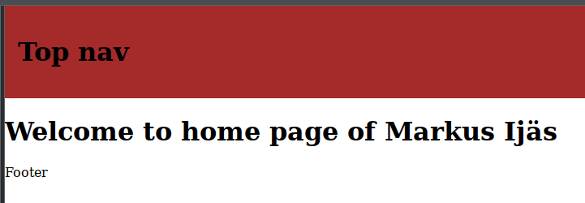
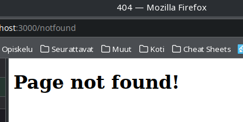

Help to complete the tasks of this exercise can be found on the chapters from ch. 10 “Connecting Views with Templates” and ch. 11 “Configurations and Error Handling” of our course book “Get Programming with Node.js” by Jonathan Wexler. Some help for the last generator task can be found from the chapter 5 “Your First Express Application” of the supplementary course book “Node.js Web Development” by David Herron. The aims of the exercise are to learn use templates in implementing views to learn, and to handle errors. 

Embed your theory answers, drawings, codes, and screenshots directly into this document. Always immediately after the relevant question. Return the document in itsLearning by the deadline.

It’s also recommendable to use Internet sources to supplement the information provided by the course book.

The maximum number of points you can earn from this exercise is 10 + 1 = 11. 

Tasks:

# 1. Explain the following concepts (4 * 0,5 = 2 points):

## a. A template 

A template (in this context) is basically a generalized layout to be used when building web pages. This means that you don't have to create all the code for every single page separately, but instead can create a simple prebuilt layout that the pages might then use to display their data.

Source: [www.computerhope.com/jargon/t/template.htm](https://www.computerhope.com/jargon/t/template.htm).

## b. A templating engine

A templating engine is a module that enables you to use static template files in your applications. It's basically scripting with which different placeholders get replaced with actual data runtime, thus the whole page getting transformed into HTML sent to clients.

Source: [expressjs.com/en/guide/using-template-engines.html](https://expressjs.com/en/guide/using-template-engines.html)

## c. An application layout

Depends on the context. In this context of server-side programming, it means how the actual program/code is structured. What design patterns and design models are used. Some examples (in no particular order) are MVC, MVT, Event-driven, Client-Server, Dependency injection and so on. Mix and match those as needed, since they are usually not meant to replace each other but to provide common solutions to specific problems.

Source: [Magic software technical notes / App layout](http://ftp.magicsoftware.com/www/help/unipaas/mergedprojects/technical%20notes/Application_Layout.htm)

## d. A partial

Basically a small code snippet (usually of plain HTML or templating language) that can be injected into multiple templates/pages run-time.

Source: common knowledge for web developers :)

# 2. Browse through the web page at https://expressjs.com/en/api.html#app.set and answer the following questions  (1 point):

## a. For what is the app.set(name, value) function used for? (0,5 points)

For assigning settings app-wide.

## b. How do you identify an error handling middleware? (0,5 points)

Basically error-handling middleware functions have four arguments instead of the usual three: `(err, req, res, next)`.

Source: [expressjs.com/en/guide/error-handling.html](https://expressjs.com/en/guide/error-handling.html)

# 3. Implement the project express_templates according to the listings 10-1 to 10-4 given in the course book’s chapter 10. 

*Make certain that you pass your name in JavaScript object from the controller operation respondWithName to your index view. Create also the partial navigation and use it. (2 points)*

**Solution in task 5**

# 4. Move the css from the html head of the file layout.ejs to an external file (Take a look at the code provided with the book). 

*Where do you save this file? Create necessary sub folders and changes into code. Test that the application is still presented as earlier. (2 points)*

**Solution in task 5**

# 5. Create custom error messages according to the instructions given in the listings of in the chapter 11 of your course book. 

*To make it a bit more challenging, modify the controller operation names and the error messages. (2 points)*

## main.js

```js
const express = require("express");
const layouts = require("express-ejs-layouts");
const homeController = require("./controllers/homeController");
const errorController = require("./controllers/errorController");

const app = express();

app.set("port", process.env.PORT || 3000);
app.set("view engine", "ejs");

app.use(express.static("public"));
app.use(
  express.urlencoded({
    extended: false,
  })
);
app.use(express.json());
app.use(layouts);

app.use((req, res, next) => {
  console.log(`A request was made from ${req.url}`);
  next();
});

app.get("/", homeController.respondWithName);

app.use(errorController.logErrors);
app.use(errorController.respondNotFound);
app.use(errorController.respondInternalServerError);

app.listen(app.get("port"), () => {
  console.log(`Server running at ${app.get("port")}`);
});
```

## controllers/homeController.js

```js
exports.respondWithName = (req, res) => {
  res.render("index", { name: "Markus Ijäs" });
};
```

## controllers/errorController.js

```js
const httpStatus = require("http-status-codes");

exports.respondNotFound = (req, res) => {
  let errorCode = httpStatus.StatusCodes.NOT_FOUND;
  res.status(errorCode);
  res.sendFile(`./public/errors/${errorCode}.html`, {
    root: "./",
  });
};

exports.respondInternalServerError = (error, req, res, next) => {
  let errorCode = httpStatus.StatusCodes.INTERNAL_SERVER_ERROR;
  console.log(`ERROR occurred: ${error.stack}`);
  res.status(errorCode);
  res.send(`${errorCode} | Sorry, our application is
experiencing a problem!`);
  next(error);
};

exports.logErrors = (error, req, res, next) => {
  console.error(error.stack);
  next(error);
};
```

## views/layout.ejs

```html
<!DOCTYPE html>
<html lang="en">
  <head>
    <meta charset="UTF-8" />
    <meta http-equiv="X-UA-Compatible" content="IE=edge" />
    <meta name="viewport" content="width=device-width, initial-scale=1.0" />
    <link
      rel="stylesheet"
      type="text/css"
      href="css/layout.css"
      media="screen"
    />
    <title>Index</title>
  </head>
  <body>
    <%- include("partials/header") %> <%- body %> <%- include("partials/footer")
    %>
  </body>
</html>
```

## views/index.ejs

```html
<h1>Welcome to home page of <%= name %></h1>
```

## views/partials/header.ejs

```html
<header>
  <h1>Top nav</h1>
</header>
```

## views/partials/footer.ejs

```html
<footer><p>Footer</p></footer>
```

## public/css/layout.css

```css
body {
  margin: 0;
  padding: 0;
}

header {
  margin-top: 0;
  padding: 1rem;
  background-color: brown;
}
```

## public/errors/404.html

```html
<!DOCTYPE html>
<html>
  <head>
    <meta charset="utf-8" />
    <title>404</title>
  </head>
  <body>
    <h1>Page not found!</h1>
  </body>
</html>
```

## Screenshots





# 6. Generating Express application skeleton. (4 * 0,5 = 2 points)

## a. Use the express-generator tool to create a basic application skeleton for the project generator-test. Take care that the view engine ejs is supported and a .gitignore file is added. 

## b. What are the basic benefits of using express-generator?

## c. What kinds of difficulties the use of express generator can cause?

## d. Explain the purpose of some of the most important files the express-generator created.