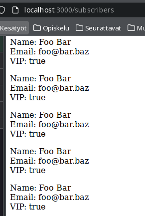
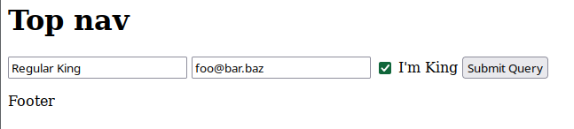
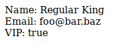

Help to complete the tasks of this exercise can be found on the chapters from ch. 13 “Setting Up a MongoDB Database”, ch. 14 “Building Models with Mongoose”, and ch. 15 “Connecting Controllers and Models” of our course book “Get Programming with Node.js” by Jonathan Wexler. The aims of the exercise are to learn working with models and to learn using a database as a permanent data storage of your web application. You will also learn to utilize promises to help you with the asynchronous programming.

This time you can earn some extra points. Due to having a three chapter’s reading area and more than a usual number of tasks the maximum number of points available is 13.

Embed your theory answers, drawings, codes, and screenshots directly into this document. Always immediately after the relevant question. Return the document in ItsLearning return box by the deadline.

It’s also recommendable to use Internet sources to supplement the information provided by the course book.

# 1. Install and setup MongoDB. Connect your recipe application to MongoDB database management system and to recipe_db database. (1 point):

## a. Install and test MongoDB database management system on your Ubuntu virtual machine. Create also the directory /data/db. 

*Please, note that if you set authentication you’ll need to make changes to some of the (You can also install it on another platform.) (0,5 points)*

Done with Docker + Docker-compose, which will be utilized throughout the tasks.

### docker-compose.yml

```yml
version: "3"

services:
  node:
    image: sswd-e06-t3
    container_name: sswd-e06-t3
    build:
      context: .
      dockerfile: Dockerfile
    volumes:
      - ./src:/usr/src/app/src
      - ./package.json:/usr/src/app/package.json
      - ./package-lock.json:/usr/src/app/package-lock.json
    ports:
      - 3000:3000
    environment:
      APP_PORT: 3000
      MONGO_PORT: 27017
      MONGO_USERNAME: root
      MONGO_PWD: password
      MONGO_DB_NAME: sswd-db
      MONGO_HOST: sswd-mongodb
    depends_on:
      - mongodb
    command: ["./entrypoint.sh"]

  mongodb:
    image: mongo:5-focal
    container_name: sswd-mongodb
    environment:
      MONGO_INITDB_ROOT_USERNAME: root
      MONGO_INITDB_ROOT_PASSWORD: password
      MONGO_INITDB_DATABASE: sswd-db
    volumes:
      - mongodb-data:/data/db

volumes:
  mongodb-data:
```

### Dockerfile

```bash
FROM node:lts-bullseye-slim
WORKDIR /usr/src/app

RUN apt update -y
RUN apt install curl -y
RUN npm install -g n
RUN n latest

COPY ./entrypoint.sh .
RUN chmod +x ./entrypoint.sh

EXPOSE 3000
```

### entrypoint.sh

```sh
#!/bin/sh

npm install
npm start
```

### package.json

```json
{
  "name": "t3",
  "version": "1.0.0",
  "description": "",
  "main": "index.js",
  "scripts": {
    "test": "echo \"Error: no test specified\" && exit 1",
    "start": "nodemon src/index.js"
  },
  "author": "Markus Ijäs",
  "license": "ISC",
  "dependencies": {
    "express": "^4.17.3",
    "mongoose": "^6.2.8",
    "nodemon": "^2.0.15"
  }
}
```

## b. Install mongodb package to your Node.js recipe application?

The same basic thing gets done in task 3.

## c. Follow the instruction give in the listing 13.5 in your course book and create the connection to the recipe_db ? Do not use the name main.js, use just mongo-test.js.

Well, this also gets basically done in task 3.

## d. Add a couple of contacts to your contacts collection according to the instructions given in the listing 13.6. Make certain that you add your own (fake) contact information too. (0,5 points)

_Please note that this database connection without authentication is extremely unsafe!!! Earn 1 extra point by adding the authentication._

As does this (in a slightly different way though).

# 2. Mongoose is an ODM. What does it mean? (1 point)

Object Document Mapping. Basically a programmatical way of mapping object models to NoSQL database documents. See: [medium.com/spidernitt/orm-and-odm-a-brief-introduction-369046ec57eb](https://medium.com/spidernitt/orm-and-odm-a-brief-introduction-369046ec57eb).

# 3. Models, Mongoose, and database. (2 points)

_Create an application that can be used to create subscribers by utilizing Mongoose. You can look for help from the listings 14.1 to 14.4._

## a. Create a new schema called Subscriber. (0,5 points)

Part of index.js:

```js
const subscriberSchema = mongoose.Schema({
  name: String,
  email: String,
  zipCode: Number,
});
```

## b. Create a model from the Subscriber Schema. (0,5 points)

Basically: `const Subscriber = mongoose.model("Subscriber", subscriberSchema);`.

## c. Make certain that you add one more feature to the scheme. The feature is called vip and it is of type Boolean. (0,5 points)

```js
const subscriberSchema = mongoose.Schema({
  name: String,
  email: String,
  zipCode: Number,
  vip: Boolean,
});
```

## d. Create at least 2 instances from the model Subscriber. Create and save the first one in two steps, and the other one in a single step. (0,5 points)

```js
//Creating a subscriber one way

var subscriber1 = new Subscriber({
  name: "Foo Bar",
  email: "foo@bar.baz",
  vip: true,
});

subscriber1.save((error, savedDocument) => {
  if (error) console.log(error);
  console.log(savedDocument);
});

//And the other way

Subscriber.create(
  {
    name: "Foo Bar",
    email: "foo@bar.baz",
    vip: true,
  },
  function (error, savedDocument) {
    if (error) console.log(error);
    console.log(savedDocument);
  }
);
```

# 4. What is a Mongoose (2 \* 0,5 = 1 point)

## a. schema?

The schema represents the structure of a particular document. Please see: [mongoosejs.com/docs/guide.html](https://mongoosejs.com/docs/guide.html).

## b. model?

Model is compiled version of schema (the runnable relation, or constructor, so to say). See: [mongoosejs.com/docs/models.html](https://mongoosejs.com/docs/models.html).

# 5. Modify your recipe application by moving the subscribers schema and the subscribers model into a separate file in the models folder (0,5 points).

_Search help from the listings 14-5 and 14.6. Make certain that you query your own contact information (0,5 points). (1 point)_

In `./models/subscriber.js`:

```js
const mongoose = require("mongoose");

const subscriberSchema = mongoose.Schema({
  name: String,
  email: String,
  zipCode: Number,
  vip: Boolean,
});

module.exports = mongoose.model("Subscriber", subscriberSchema);
```

And in `index.js`:

```js
const Subscriber = require("./models/subscriber");
```

# 6. Follow the instructions given in the listings 14.1 to 14.6, but this time create a schema and a model to the recipe item. (1 point)

Well, this is kind of a minimum viable product:

```js
const mongoose = require("mongoose");

const recipeSchema = mongoose.Schema({
  name: String,
  timeToComplete: Number,
  directions: String,
});

module.exports = mongoose.model("Recipe", recipeSchema);
```

And in index.js:

```js
Recipe.create(
  {
    name: "Test Recipe",
    timeToComplete: 45,
    directions: "Directions...",
  },
  function (error, savedDocument) {
    if (error) console.log(error);
    console.log(savedDocument);
  }
);

var myQuery = Recipe.findOne({
  name: "Test Recipe",
}).where("name", /Test Recipe/);
myQuery.exec((error, data) => {
  if (data) console.log(data.name);
});
```

Outputs "Test Recipe" as expected.

# 7. Putting all together: MVC. (2 points)

_Follow the instructions given in the listings 15.1 to 15.3 and use models, views, and controllers (MVC) together to display the subscribers on a web page. Utilize also the source code that is available from the book’s github site._

## a. Implement your subscribers controller. (0,5 points)

```js
const Subscriber = require("../models/subscriber");

exports.getAllSubscribers = (req, res, next) => {
  Subscriber.find({}, (error, subscribers) => {
    if (error) next(error);
    req.data = subscribers;
    next();
  });
};
```

## b. Use your controller in the main program. (0,5 points)

```js
const subscribersController = require("./controllers/subscribersController");
```

and

```js
app.get(
  "/subscribers",
  subscribersController.getAllSubscribers,
  (req, res, next) => {
    console.log(req.data);
    res.render("subscribers", { subscribers: req.data });
  }
);
```

## c. Display the subscribers on the view (on the subscribers.ejs) . (0,5 points)

```js
<%subscribers.forEach(s => { %>
<p>
  Name: <%= s.name %><br />
  Email: <%= s.email %><br />
  VIP: <%= s.vip %>
</p>
<% }); %>
```



## d. Please make certain that also the vip status is displayed. (0,5 points)

Seen above, and on task 8d.

# 8. Adding subscribers from the web form. (2 points)

## a. Add the contact page. (0,5 points)

```js
<form action="/subscribe" method="post">
  <input type="text" name="name" placeholder="Name" />
  <input type="text" name="email" placeholder="Email" />
  <input type="checkbox" name="vip" id="vip-checkbox" />
  <label for="vip-checkbox">I'm King</label>
  <input type="submit" name="submit" />
</form>
```

## b. Add the routes to the main. (0,5 points)

```js
app.get("/contact", subscribersController.getSubscriptionPage);
app.post("/subscribe", subscribersController.saveSubscriber);
```

## c. Add the controller actions into the controller. (0,5 points)

```js
const Subscriber = require("../models/subscriber");

exports.getAllSubscribers = (req, res, next) => {
  Subscriber.find({}, (error, subscribers) => {
    if (error) next(error);
    req.data = subscribers;
    next();
  });
};

exports.getSubscriptionPage = (req, res) => {
  res.render("contact");
};

exports.saveSubscriber = (req, res) => {
  let newSubscriber = new Subscriber({
    name: req.body.name,
    email: req.body.email,
    vip: req.body.vip,
  });

  newSubscriber.save((error, result) => {
    if (error) res.send(error);
    res.render("thanks");
  });
};
```

## d. Please make certain that also the vip status can be saved. (0,5 points)

_Follow the instructions given in the listings 15.4 to 15.6 and make certain that the user can add new subscribers from the contact page._

It works. See screenshots below, and code on tasks above.





# 9. Follow the instruction given in the listings 15.7 and 15.8 and change your subscribers controller to be promise-based. (2 \* 1 = 2 points)
